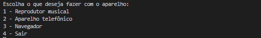
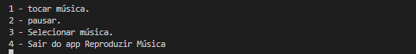

# projetos-funcoes-de-um-dispositivo

## 📖 Introdução

O projeto "Funções de um Dispositivo" é uma iniciativa concebida para emular a experiência de um dispositivo móvel, incorporando diversas funcionalidades essenciais, como um reprodutor de música, telefone e navegador. O projeto se estrutura em torno de um fluxo de interações que simula a operação de um dispositivo real, desde a inicialização até a seleção da funcionalidade desejada, culminando na execução da ação final.

Os conteúdos principais a serem explorados são:

- Fundamentos de POO.
- Pilares POO.
- Collections em Java.
- Stram API.

## Exemplo com o "app" de música:

### Entrada do dispositivo:

| <br><sub>inicialização do dispositivo</sub> |
| :-------------------------------------------------------------------------------------------: |

### Entrada do app de música:

| <br><sub>"app" reprodutor musica</sub><br> |
| :-----------------------------------------------------------------------------------------------: |

### Execução do app:

| <br><sub>resultado final</sub><br> |
| :-------------------------------------------------------------------------------------: |

## Funcionalidades

```bash
. Interação do usuário com o terminal.
```

## 💡Programas utilizados:

- VSCode

## 💻Tecnologias


## 📫 Contato

<p>Email: italo.rocha.de.oliveira@gmail.com</p>

<a href = "mailto:italo.rocha.de.oliveira@gmail.com"></a>
<a href="https://www.linkedin.com/in/italorochaoliveira/" target="_blank"></a>
